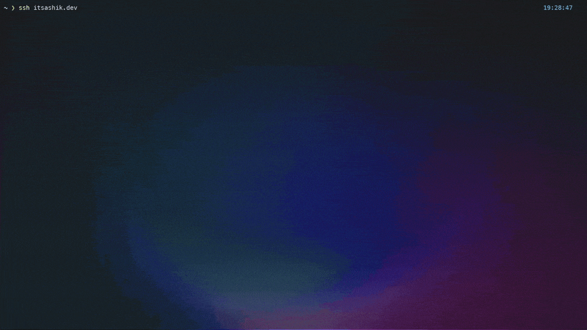

# Portfolio TUI

A terminal-native portfolio built with Go, Bubble Tea, Bubbles, and Lip Gloss. It can run locally as a full-screen TUI or as an SSH-accessible portfolio server powered by Wish.



## What it feels like

`portfolio-tui` opens with a short boot screen, then drops into a two-pane interface:

- A left sidebar for navigation
- A right content pane for Home, Projects, Skills, Experience, Education, Blogs, and Contact Me
- Detail views for projects and blog posts
- Searchable lists for projects and blogs
- A full-screen help overlay and a table of contents overlay for blog posts

The Home screen is styled like a neofetch-style profile card and highlights your bio, skills, featured projects, and latest posts.

## Features

- Runs in two modes: local TUI and SSH server
- Personalized branding from `config.yaml`
- Sanity-backed content for projects, skills, posts, contact links, experience, and education
- Graceful fallback content when Sanity is unavailable
- Keyboard-first navigation with vim-style bindings
- Search/filter support for project and blog lists
- Blog detail pages with Portable Text rendering and `t` table of contents
- Project detail pages with metadata, links, and technologies
- Mouse wheel support for scrollable views
- Docker and Docker Compose support for self-hosting

## Quick Start

### 1. Clone and install dependencies

```bash
git clone https://github.com/MeAshikeqbal/portfolio-tui
cd portfolio-tui
go mod download
```

### 2. Create your config

```bash
cp config.example.yaml config.yaml
```

Then edit `config.yaml` with your name, role, bio, social links, ASCII logo, and SSH defaults.

If you want an interactive setup flow, you can also run:

```bash
./setup-config.sh
```

More config details live in [CONFIG.md](CONFIG.md).

### 3. Optional: create `.env`

Sanity and SSH runtime settings are loaded from environment variables. There is no `.env.example` in the repo right now, so create `.env` manually if you want to override the defaults:

```env
SANITY_PROJECT_ID=your_project_id
SANITY_DATASET=production
SANITY_API_VERSION=2024-12-21

PORTFOLIO_SSH_HOST=0.0.0.0
PORTFOLIO_SSH_PORT=23234
PORTFOLIO_SSH_KEY=.ssh/term_key
PORTFOLIO_BIND_IP=0.0.0.0
```

Notes:

- `config.yaml` controls your profile, branding, and default SSH settings
- `.env` is mainly for Sanity access and runtime SSH overrides
- if the SSH host key file does not exist, the app generates it automatically

### 4. Run locally

```bash
go run .
```

Or build a binary:

```bash
go build -o portfolio-tui
./portfolio-tui
```

### 5. Run as an SSH portfolio

```bash
go run . serve
```

Or with the built binary:

```bash
./portfolio-tui serve
```

Then connect from another terminal:

```bash
ssh -p 23234 localhost
```

## Navigation

### Main sections

The live menu in the app is:

1. `Home`
2. `Projects`
3. `Skills`
4. `Experience`
5. `Education`
6. `Blogs`
7. `Contact Me`
8. `Exit`

### Keybindings

#### Global

- `?` toggle help
- `q` or `Ctrl+C` quit

#### Menu view

- `↑` / `k` move up
- `↓` / `j` move down
- `Enter` open the selected section
- `H`, `P`, `S`, `E`, `D`, `B`, `C`, `X` jump directly to a menu item

#### Content views

- `Esc` go back
- `PgUp` / `b` page up
- `PgDn` / `f` page down
- `Home` / `g` jump to top
- `End` / `G` jump to bottom

#### List views

- `/` filter projects or blog posts
- `Enter` open the selected project or post

#### Blog detail

- `t` open the table of contents overlay
- `1-9` jump to a heading while the TOC is open

## Content and Customization

The app reads portfolio identity and branding from `config.yaml`, and fetches live content from Sanity for:

- `project`
- `skills`
- `about`
- `socialLink`
- `post`
- `experience`
- `education`

If Sanity is unavailable, the UI still boots and falls back to built-in placeholder content, which makes local development and demos much easier.

## Docker

The container starts in SSH server mode by default. If you use the commands below as-is, create `.env` first or replace `--env-file .env` with explicit `-e` flags.

```bash
docker build -t portfolio-tui .

docker run --rm -p 0.0.0.0:23234:23234 \
  --env-file .env \
  -v "$(pwd)/config.yaml:/app/config.yaml:ro" \
  portfolio-tui
```

Connect with:

```bash
ssh -p 23234 localhost
```

Useful variants:

```bash
# Persist generated SSH keys and logs
docker run --rm -p 23234:23234 \
  --env-file .env \
  -v "$(pwd)/config.yaml:/app/config.yaml:ro" \
  -v "$(pwd)/.ssh:/app/.ssh" \
  -v "$(pwd)/logs:/app/logs" \
  portfolio-tui

# Run local mode inside an interactive container
docker run --rm -it \
  --env-file .env \
  -v "$(pwd)/config.yaml:/app/config.yaml:ro" \
  portfolio-tui local
```

## Docker Compose

`compose.yaml` runs the published GHCR image in SSH mode, mounts `config.yaml`, and stores SSH keys plus logs in Docker volumes. Compose also reads `.env`, so create that file before running these commands.

```bash
docker compose pull
docker compose up -d
docker compose logs -f
docker compose down
```

Useful environment values:

```env
PORTFOLIO_IMAGE=ghcr.io/meashikeqbal/portfolio-tui:latest
PORTFOLIO_SSH_PORT=23234
PORTFOLIO_BIND_IP=0.0.0.0
```

To inspect or remove persistent data:

```bash
docker volume inspect portfolio-tui_portfolio_tui_ssh
docker volume inspect portfolio-tui_portfolio_tui_logs
docker compose down -v
```

## Development

```bash
go fmt ./...
go build .
```

## Stack

- Go
- Bubble Tea
- Bubbles
- Lip Gloss
- Wish
- Sanity CMS